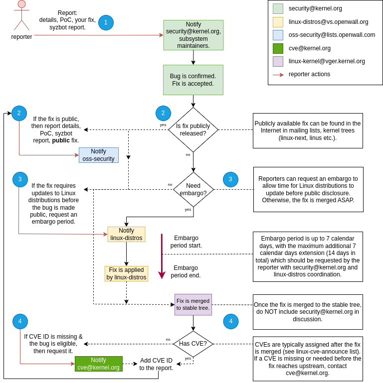

# Reporting Linux kernel bugs

Before reporting a bug **make sure nobody else has already reported it**. The easiest way to do
this is to search through the [syzkaller mailing list](https://groups.google.com/forum/#!forum/syzkaller),
[syzkaller-bugs mailing list](https://groups.google.com/forum/#!forum/syzkaller-bugs),
[syzbot dashboard](https://syzkaller.appspot.com/upstream),
and [kernel mailing lists](https://lore.kernel.org/) for key frames present in the kernel stack traces.

**Do NOT report bugs on old kernel versions**.
Old kernel generally means older than a week. Reports on old kernels are typically not considered as valid,
and asked to be reproduced on a fresh kernel. Do not report bugs found on stable/LTS kernels.
Bugs on stable/LTS kernels should be reproduced on a fresh upstream kernel, and reported as such.
Or, if they are already fixed upstream, the fix commit should be
[submitted to stable](https://www.kernel.org/doc/html/next/process/stable-kernel-rules.html).

Please **report bugs to the Linux kernel maintainers**.
To find out the list of maintainers responsible for a particular kernel subsystem, use the [get_maintainer.pl](https://github.com/torvalds/linux/blob/master/scripts/get_maintainer.pl) script: `./scripts/get_maintainer.pl -f guilty_file.c`. Please add `syzkaller@googlegroups.com` to the CC list.

**Minimal info** to include in the report:
 - exact kernel branch and revision where the bug occurred
 - exact kernel .config
 - kernel OOPS message (BUG, KASAN report, etc), **preferably with source files and line numbers**
 - reproducer, if known (see below)

**Properly configure the kernel**.
An improperly-configured kernel may lead to bad, and even false reports. There is no official way to get
proper config for testing/fuzzing. You need to tune timeouts, enable debug info, enable lots of debug configs,
disable some other debug configs, etc. You may use one of
[syzbot configs](/dashboard/config/linux/upstream-apparmor-kasan.config), or check guidelines for
[individual settings](/dashboard/config/linux/bits).

Your email client should be configured in **plain text mode** when sending bug reports.
Kernel mailing lists reject HTML formatted messages. For example, if you use GMail set "Plain text mode" option.

**Do NOT mimic [syzbot](/docs/syzbot.md) reports**.
For example, don't say "syzbot has found". However, you should mention that the bug is found with syzkaller.

Think of what you report. Today, Linux maintainers are overwhelmed with bug reports, so increasing the incoming flow won't help to fix all the bugs.
The more actionable your report is, the higher the chance that it will be addressed.
Note that people are more likely to care about kernel crashes (e.g. use-after-frees or panics) than of INFO: messages and such, unless it is clearly visible from the report what exactly is wrong.
If there are stalls or hangs, only report them if they are frequent enough or have a reliable reproducer.

Overall, bugs without reproducers are way less likely to be triaged and fixed.
If the bug is reproducible, include the reproducer (C source if possible, otherwise a syzkaller program) and the `.config` you used for your kernel.
If the reproducer is available only in the form of a syzkaller program, please link [the instructions on how to execute them](/docs/reproducing_crashes.md#using-a-c-reproducer) in your report.
Check that the reproducer works if you run it manually.
Syzkaller tries to simplify the reproducer, but the result might not be ideal.
You can try to simplify or annotate the reproducer manually, that greatly helps kernel developers to figure out why the bug occurs.

If you want to get extra credit, you can try to understand the bug and develop a fix yourself.
If you can't figure out the right fix, but have some understanding of the bug, please add your thoughts and conclusions to the report, that will save some time for kernel developers.

## Reporting security bugs

If you believe that a found bug a poses a potential security threat, consider the following instructions below.
The initial version of these guidelines was discussed [here](http://seclists.org/oss-sec/2017/q3/242).

The three main mailing lists for reporting and disclosing Linux kernel security issues are listed below with guidelines.
Please read them carefully before sending anything to these lists.

1. `security@kernel.org` - https://docs.kernel.org/process/security-bugs.html.

    The security team wants to release the fix ASAP, but may postpone it if the reporter asks for an embargo period to let linux-distros update their kernels.

2. `linux-distros@vs.openwall.org` - https://oss-security.openwall.org/wiki/mailing-lists/distros

    The goal of the "linux-distros" team is to coordinate the rollout of a ready, actionable, non-public fix
    to Linux distributions within the embargoed period. This ensures that distributions can apply the fix in advance,
    reducing the risk to users once the vulnerability is publicly disclosed.

3. `oss-security@lists.openwall.com` - https://oss-security.openwall.org/wiki/mailing-lists/oss-security

    Public disclosure to the security group with the optional exploitation write-up and CVE reference.

4. `cve@kernel.org` - https://www.kernel.org/doc/html/latest/process/cve.html

    Official kernel.org CNA. CVE assignment team has its own procedure of manual voting whether the bug is CVE eligible.

### Vulnerability definition

From [cve.org](https://www.cve.org/resourcessupport/allresources/cnarules):

> A vulnerability is an instance of one or more weaknesses in a Product that can be exploited,
> causing a negative impact to confidentiality, integrity, or availability; a set of conditions
> or behaviors that allows the violation of an explicit or implicit security policy.

According to [Greg Kroah-Hartman](https://youtu.be/KumwRn1BA6s?t=203), a kernel vulnerability is defined as:
> * Any user-triggerable crash or reboot
> * Memory UAF / leak / overflow (even 1 byte)
> * Incorrect boundary checks
> * Denial of service
> * Logic errors & lots of other things*

*Data corruption/loss, performance issues, bugs that are not externally triggered are not considered kernel vulnerabilities.

### Linux kernel security bug reporting

These instructions are based on the [kernel.org guidelines](https://docs.kernel.org/process/security-bugs.html), which do not require CVE assignment.
CVE assignment instructions are provided below.

Privately report the bug to security@kernel.org and the maintainers of the affected subsystem(s).
The maximum embargo for security@kernel.org is **7 calendar days**, starting from the beginning of the fix release process.
In contrast, the embargo period for linux-distros@vs.openwall.org begins when you first post to the list, regardless of whether a fix is available.

That's why it's strongly recommended to NOT include "[linux-distros](https://oss-security.openwall.org/wiki/mailing-lists/distros)" mailing lists in CC
UNTIL the fix is accepted by affected systems' maintainers.
>  In other words, until a fix is accepted do not Cc: “linux-distros”, and after it’s merged do not Cc: the kernel security team.

When reporting the security bug to `security@kernel.org`, keep everything in **plain text**, including the fix, exploit code etc.,
think of it like a [regular Linux kernel patch submission](https://docs.kernel.org/process/submitting-patches.html).

### CVE assignment

kernel.org is now CNA (from [February 13, 2024](https://www.cve.org/Media/News/item/news/2024/02/13/kernel-org-Added-as-CNA)),
therefore they have reserved CVE IDs for the kernel vulnerability bugs classified as CVE.

CVE assignments (sometimes rejections) are publicly announced in the public list, see [linux-cve-announce](https://lore.kernel.org/linux-cve-announce) on which you can [subscribe](https://subspace.kernel.org/subscribing.html).

CVEs are typically assigned after the fact, with a delay of 1-2 weeks.

> Note: No hardware CVEs are issued by the Linux community (SPECTRE-like CVEs come from other sources) (c) Greg K-H.

For example, bugs in drivers that relate to the Linux kernel may be treated as CVEs.
However, hardware bugs in components like CPUs, NICs, and other chips that affect multiple operating systems (e.g., Linux kernel, Windows, macOS)
and are not caused by Linux kernel code should be handled by the hardware vendor.

Averaging 55 CVEs per week (2024 Q3):
> The CVE assignment team is very thorough and assigns CVE numbers to any bugfix that they identify.
> This explains the seemingly large number of CVEs that are issued by the Linux kernel team.

Kernel CVE assignment process is explained [here](https://www.kernel.org/doc/html/latest/process/cve.html), quoting the important paragraph:
> If the CVE assignment team misses a specific fix that any user feels should have a CVE assigned to it,
> please email them at <cve@kernel.org> and the team there will work with you on it.
> Note that no potential security issues should be sent to this alias,
> it is ONLY for assignment of CVEs for fixes that are already in released kernel trees.
> If you feel you have found an unfixed security issue, please follow the [normal Linux kernel security bug reporting process](https://docs.kernel.org/process/security-bugs.html).

An example of a kernel-assigned CVE: [CVE-2024-50078](https://lore.kernel.org/linux-cve-announce/2024102936-CVE-2024-50078-cfe9@gregkh/T/#u).

### Process

1. Understand the bug and develop a patch with a fix if possible. Optionally develop a proof-of-concept exploit.
    * Notify `security@kernel.org`
    * As the [recommendation](https://docs.kernel.org/process/security-bugs.html#coordination-with-other-groups), do not include `linux-distros@vs.openwall.org` in conversation at this moment.
    * Describe vulnerability details, include the proposed patch and optionally the exploit **in plain text**.
    * Security team may include in the mailing list necessary maintainers for the confirmation if you haven't included them yet.
    * Work on the patch (fix) together with the `security@kernel.org` and affected system maintainers.
    * If the bug is found via syzbot report, make sure that the patch includes `Fixes` tag of the correspondent syzbot report.

2. If the fix is merged to the kernel stable tree, hence it's publicly available:
    * Notify `oss-security@lists.openwall.com`:
    * Describe vulnerability details, include a link to the committed patch.
    * See step 4. if CVE is required.
    * If all distros have released the update with the fix, then optionally publish the exploit on `oss-security@lists.openwall.com`, and the link to write-up if there is any.
3. If the fix is not merged yet:
    * Notify `linux-distros@vs.openwall.org` in the same mailing list for convenience
    * Describe vulnerability details, include the accepted earlier patch and optionally the exploit.
    * If the fix can wait for the embargo period (up to 7 calendar days):
        * Ask for 7 calendar days of embargo. Within this time, distro people can update their kernels and the fix can land in the stable tree.
    * otherwise,
        * the fix can be merged to the stable tree ASAP per `security@kernel.org`'s preference.
4. Once the fix is merged to the stable tree and it's now offically, publicly available:
    * If CVE is applicable to this bug (see [Vulnerability definition](#vulnerability-definition)), the proceed with CVE assigment:
        * Check [linux-cve-announce](https://lore.kernel.org/linux-cve-announce) if the CVE is assigned to your security bug's fix
        * If CVE is missing, then:
            * request CVE from `cve@kernel.org` by pointing to the upstream fix
    * Optionally, notify `oss-security@lists.openwall.com` as described in step 2.
