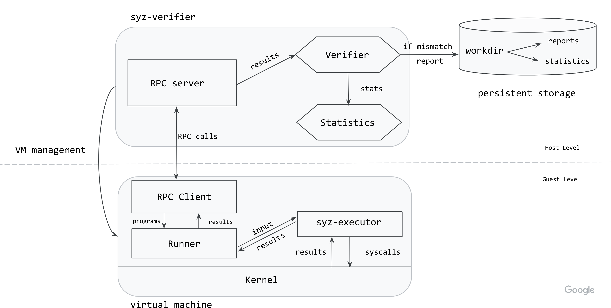

# syz-verifier

Testing and fuzzing aim to verify a subset of the behaviours of running programs: any logical error can cause
bugs that make the program behave incorrectly, possibly producing unintended output. Many bugs, however, do
not cause the program to crash nor produce assertion failures.

The behaviour of a program can be classified as either defined or undefined. Undefined behaviour can easily be detected by either static (e.g. compiler warnings) or dynamic analysis (e.g. sanitizers). However, logical errors that result in defined program behaviour, yet are still causing
bugs that make the program behave incorrectly (according to some documented or otherwise expected intent),
are much harder to detect. One way to detect such bugs is setting up test cases that compare program outputs
against a set of expected results (e.g. by manually creating integration or unit tests).

Differential fuzzing automates this process by providing the same input to different implementations and then
cross-comparing the resulting behaviour to determine whether it is identical. Here it is assumed that one of the implementations is a correct reference implementation.
For example, such a reference implementation could be an identically behaving model, but otherwise very different implementation; but it could also be an older, assumed correct version of the same implementation.


`syz-verifier` is a differential fuzzing tool that cross-compares the execution of programs,
generated using `syzlang`, on different versions of the Linux kernel.

The architecture of `syz-verifier` is shown in the following diagram.



The `syz-verifier` process starts and manages VM instances with the kernels to be cross-compared. It also starts the `syz-runner` process on the VMs. Communication between the host and the guest is done via RPCs.

`syz-verifier` generates and sends a continuous stream of programs to `syz-runner` via RPCs while
`syz-runner` is responsible for starting `syz-executor` processes and turning the program into input for
those. `syz-executor` processes the input, which triggers a sequence of syscalls in the kernel. Then,
`syz-runner` collects the results and sends them back to the host.

 At the moment, the results contain the errnos returned by each system call. When `syz-verifier` has received results from all the kernels for a specific program, it verifies them to
 ensure they are identical. If a mismatch is found, the program is rerun on all the kernels to ensure the
 mismatch is not flaky (i.e. it didn't occur because of some background activity or external state). If the
 mismatch occurs in all reruns, `syz-verifier` creates a report for the program and write it to persistent
 storage.

# How to use `syz-verifier`

After cloning the repository (see how [here](/docs/linux/setup.md#go-and-syzkaller)), build the tool as:

```
make verifier runner executor
```

To start using the tool, separate configuration files need to be created for each kernel you want to include
in the verification. An example of Linux configs can be found [here](/docs/linux/
setup_ubuntu-host_qemu-vm_x86-64-kernel.md#syzkaller). The configuration files are identical to those used by `syz-manager`.

If you want to generate programs from a specific set of system calls, these can be listed in the kernel
config files using the `enable_syscalls` option. If you want to disable some system calls, use the `disable_syscalls` option.

Start `syz-verifier` as:
```
./bin/syz-verifier -configs=kernel0.cfg,kernel1.cfg
```

`syz-verifier` will also gather statistics throughout execution. They will be printed to `stdout` by default, but an alternative file can be specified using the `stat` flag.

# How to interpret the results

Results can be found in `workdir/results`.

When `syz-verifier` finds a mismatch in a program, it will create a report for that program. The report lists
the results returned for each system call, by each of the cross-compared kernels, highlighting the ones were
a mismatch was found. The system calls are listed in the order they appear in the program.

An extract of such a report is shown below:

```
ERRNO mismatches found for program:

[=] io_uring_register$IORING_REGISTER_PERSONALITY(0xffffffffffffffff, 0x9, 0x0, 0x0)
        ↳ Pool: 0, Flags: 3, Errno: 9 (bad file descriptor)
        ↳ Pool: 1, Flags: 3, Errno: 9 (bad file descriptor)

[=] syz_genetlink_get_family_id$devlink(&(0x7f0000000000), 0xffffffffffffffff)
        ↳ Pool: 0, Flags: 3, Errno: 2 (no such file or directory)
        ↳ Pool: 1, Flags: 3, Errno: 2 (no such file or directory)

[!] r1 = io_uring_setup(0x238e, &(0x7f0000000240)={0x0, 0xf39a, 0x20, 0x0, 0x146})
        ↳ Pool: 0, Flags: 3, Errno: 6 (no such device or address)
        ↳ Pool: 1, Flags: 3, Errno: 9 (bad file descriptor)
...
```

The order of the results is given by the order in which configuration files were passed so `Pool: 0 ` reports results for the kernel created using `kernel0.cfg` and so on.

The [Flags](/pkg/ipc/ipc.go#L82) can be used to determine the state reached by the system call:
* `0` = syscall not even started
* `1` = syscall started
* `3` = syscall finished executing
* `7` = syscall blocked
