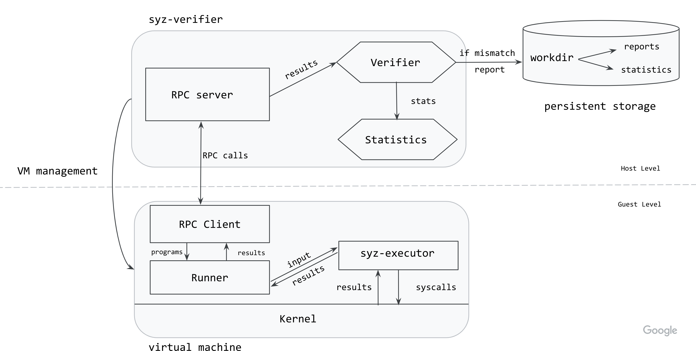

# syz-verifier

Many bugs are easy to detect: they might cause assertions failures, crash our
system, or cause other forms of undefined behaviour detectable by various
dynamic analysis tools. However, certain classes of bugs, referred to as
*semantic bugs*, cause none of these while still resulting in a misbehaving
faulty system.

To find semantic bugs, one needs to establish a specification of the system's
*intended behaviour*. Depending on the complexity of the system, creating and
centralising such specifications can be difficult. For example, the
"specification" of the Linux kernel is not found in one place, but is rather a
collection of documentation, man pages, and the implied expectations of a vast
collection of user space programs. As such, detecting semantic bugs in the
Linux kernel is significantly harder than other classes of bugs. Indeed, many
test suites are meant to detect regressions, but creating and maintaining test
cases, as well as covering new features requires significant amounts of
engineering effort.

One way to automate detection of semantic bugs is to provide the same input to
different implementations, or different versions of the same system, and then
cross-compare the resulting behaviour. In case the systems disagree, at least
one of them is assumed to be wrong.

The current `syz-verifier` is not fuzzing new inputs. Instead, it loads a
corpus of existing syzkaller programs and cross-compares their execution on
different versions of the Linux kernel to detect semantic bugs.

The architecture of `syz-verifier` is shown in the following diagram.



The `syz-verifier` process starts and manages VM instances with the kernels to
be cross-compared. It also starts the `syz-runner` process on the VMs.
Communication between the host and the guest is done via RPCs.

At startup, `syz-verifier` loads programs from a syzkaller corpus database
(`corpus.db`). It then sends each corpus program to `syz-runner` on every VM
via RPCs while `syz-runner` is responsible for starting `syz-executor`
processes and turning the program into input for those.
`syz-executor` processes the input, which triggers a sequence of syscalls in
the kernel. Then, `syz-runner` collects the results and sends them back to the
host.

At the moment, the results contain the errnos returned by each system call.
When `syz-verifier` has received results from all the kernels for a specific
program, it verifies them to ensure they are identical. If a mismatch is found,
`syz-verifier` creates a report for the founded mismatch including the program mismatch details.

# How to use `syz-verifier`

After cloning the repository (see how
[here](/docs/linux/setup.md#go-and-syzkaller)), build the tool as:

```
make verifier runner executor
```

To start using the tool, separate configuration files need to be created for
each kernel you want to include in the verification. An example of Linux
configs can be found [here](/docs/linux/setup_ubuntu-host_qemu-vm_x86-64-kernel.md#syzkaller). The configuration files
are identical to those used by `syz-manager`.

All compared kernels must use the same `workdir`. `syz-verifier` loads the
corpus from `corpus.db` in that shared `workdir`, so the first config must
point at the workdir whose corpus you want to verify.

If you want to constrain verification to programs that use a specific set of
system calls, list them in the kernel config files using the
`enable_syscalls` option. If you want to disable some system calls, use the
`disable_syscalls` option.

Start `syz-verifier` as:
```
./bin/syz-verifier -configs=kernel0.cfg,kernel1.cfg
```

`syz-verifier` logs its progress throughout execution, including corpus loading
and per-program comparison progress.

# How to interpret the results

Results can be found in `workdir/results`.

When `syz-verifier` finds a mismatch in a program, it will create a report for
that program. The report lists the results returned for each system call, by
each of the cross-compared kernels, highlighting the ones were a mismatch was
found. The system calls are listed in the order they appear in the program.

An extract of such a report is shown below:

```
ERRNO mismatches found for program:

========== ERRNO MISMATCH DETECTED ==========
Between: Kernel 0 (kernel-6.17) and Kernel 1 (kernel-6.2)

Complete Program Sequence:
-------------------------------------------
    [0] capset(&(0x7f0000000380)={0x19980330}, &(0x7f00000003c0))
        Result: errno=0, flags=0x3

>>> [1] r0 = socket$inet6_tcp(0xa, 0x1, 0x0)
>>>     ┌─ : errno=0, flags=0x3
>>>     └─ : errno=2, flags=0x3

>>> [2] setsockopt$inet6_tcp_TCP_CONGESTION(r0, 0x6, 0xd, &(0x7f0000000000)='cubic', 0x3)
>>>     ┌─ : errno=2, flags=0x3
>>>     └─ : errno=9, flags=0x3

-------------------------------------------
Kernel Outputs:
  : ""
  : ""
=============================================
...
```

In this report, lines prefixed with `>>>` highlight the calls whose returned
errnos differed between kernels. The two indented result lines under such a
call show the values returned by each compared kernel for that exact syscall.
The `Kernel Outputs` section records the raw runner output for each kernel,
which is useful when a mismatch is caused by a crash, timeout, or some other
execution problem rather than a pure semantic difference.
