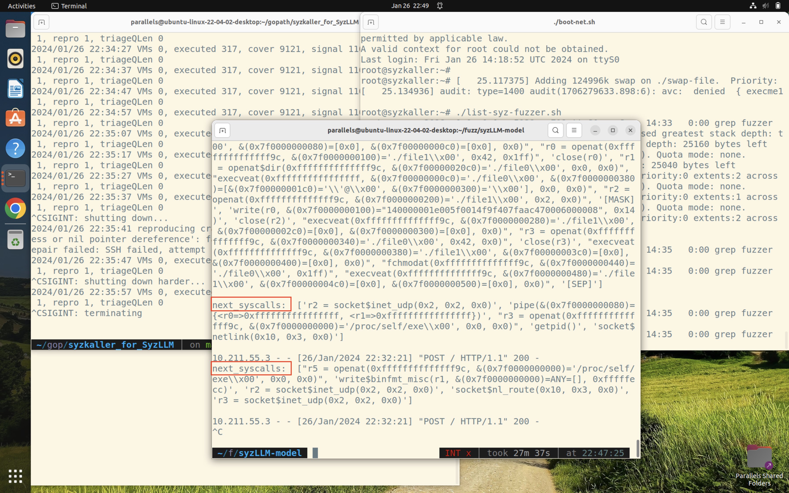
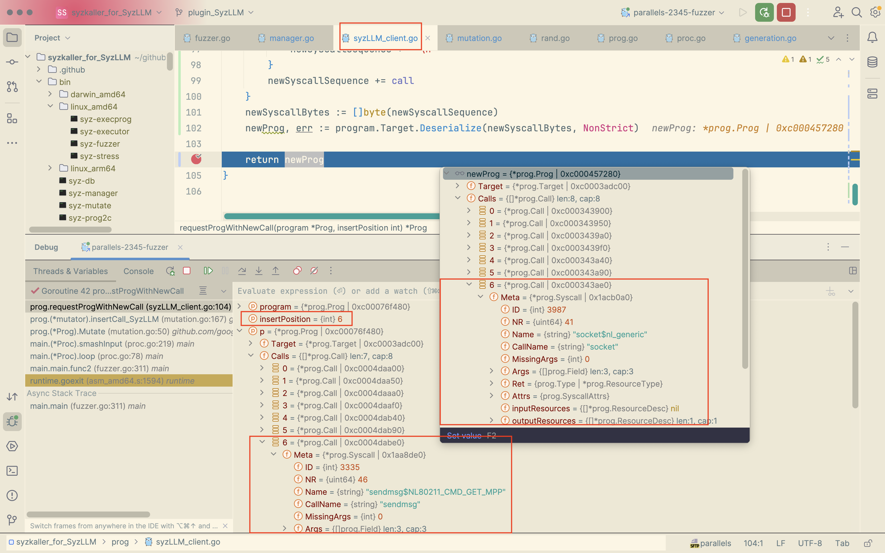
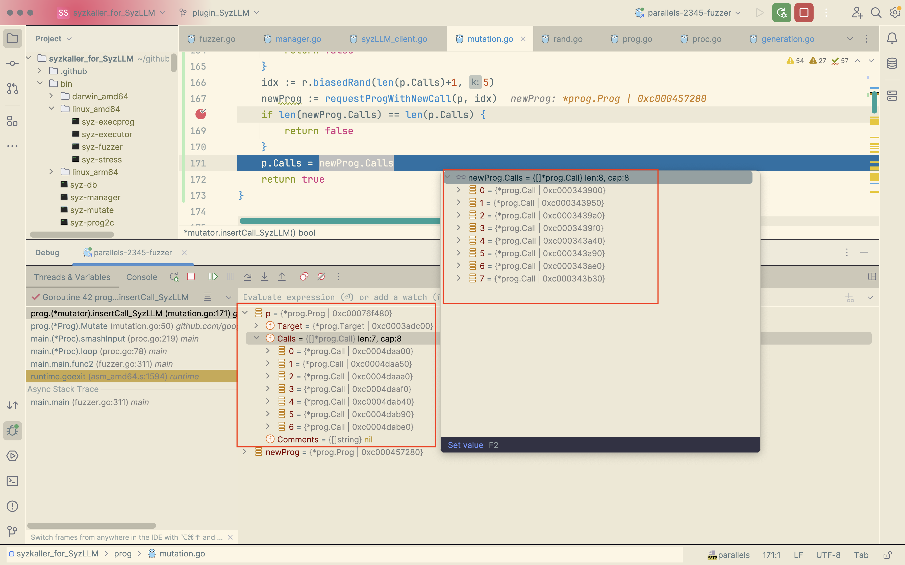
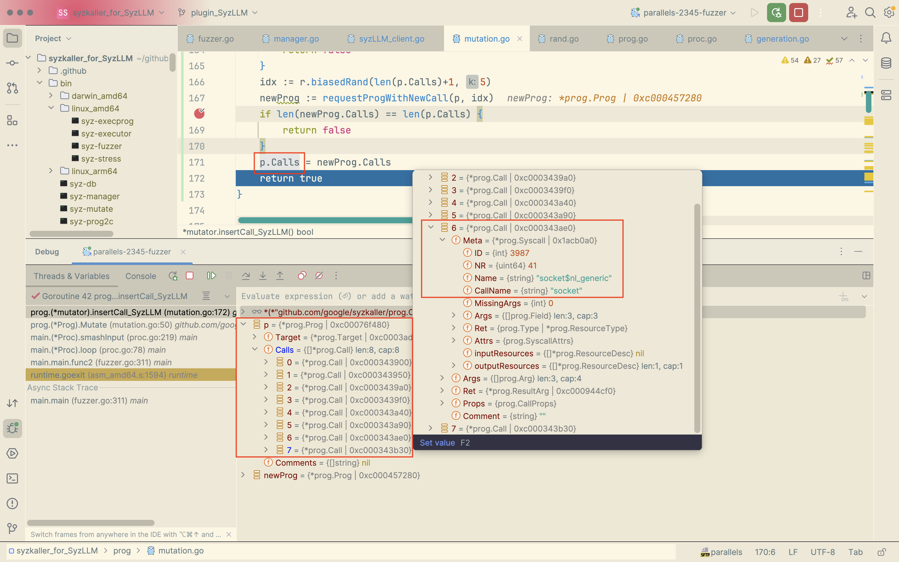

# Log

### Jan-26-Fri-2024

SyzLLM can start working!

1. The SyzLLM-Server receive request calls and generate **top5** syscalls that most matched at the specific position in the request sequence, and return the **first** syscall in the top5 calls.

2. The syzLLM-client receive the call and insert it to the positin to generate a new program. 

   Like below the `newProg` insert `socket` to position 6 where placing the `sendmsg` before insert.

3. In the mutation.go, assign the new syscall sequence to the origin program.

### Jan-18-Thu-2024

1. SyzLLM_client:
   1. **Coming soon**: prog.Prog -> corpus.record (prompt to SyzLLM);
   2. **Coming soon**: Coding;
   3. Test;
2. SyzLLM_Server:
   1. **Done**: corpus.record (stored in DB) parse to prog.Prog (To be executed);
   2. Coding;
   3. Test;

3. Plugin client around mutation.go/line 152 and rand.go/generateCall().

### Jan-02-Fri-2024

Init branch.

Built syzkaller locally instead of in Ubuntu to debug.